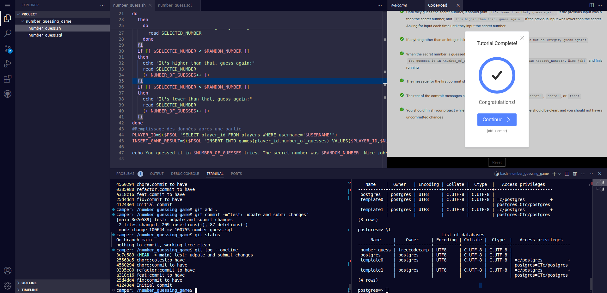

## Build a Number Guessing Game

This is one of the required projects to earn your certification. For this 
project, you will use Bash scripting, PostgreSQL, and Git to create a 
number guessing game that runs in the terminal and saves user information.

#### cover image of final project

Thank's freecodecamp, this certification was too awesome, great job and 
go forward @mrvin100
